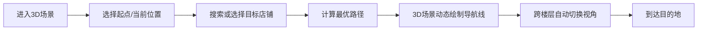
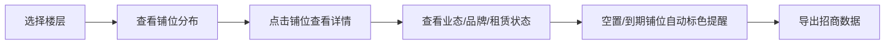
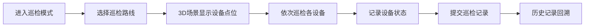

## 1. 产品概述

多层商业综合体（购物中心+步行街+地下车库+户外广场）前端3D可视化导视与业态管理平台，集三维地图、智能导航、业态展示、铺位管理、人流热力可视化、设施巡检于一体的综合型商用3D可视化项目。

- **核心目标**：为商业综合体提供全场景3D数字化管理工具，兼顾顾客导览、运营管理、招商分析、设施巡检多重用途
- **目标用户**：商场顾客、运营管理人员、招商团队、设施巡检人员
- **产品价值**：提升顾客购物体验、优化运营管理效率、辅助招商决策、保障设施安全运行

## 2. 核心功能

### 2.1 用户角色

| 角色 | 使用方式 | 核心权限 |
|------|----------|----------|
| 顾客 | 大屏/移动端访问 | 楼层浏览、店铺查询、智能导航、业态查看 |
| 运营管理员 | 后台系统 | 铺位管理、业态调整、人流监控、数据导出 |
| 招商人员 | 后台系统 | 空置铺位查看、租赁状态管理、到期预警 |
| 巡检人员 | 移动/PC端 | 巡检路线、设备状态查看、巡检记录提交 |

### 2.2 功能模块

1. **三维场景主视图**：全场景3D建模展示、楼层切换、图层显隐控制
2. **智能导航模块**：起终点设置、路径规划、动态导航线、跨楼层导航
3. **业态与铺位管理**：商铺信息展示、租赁状态、业态分类、详情面板
4. **人流热力图**：实时热力分布、热门区域识别、数据时间轴
5. **设施巡检模块**：设备点位标记、巡检路线、状态监控、记录回溯
6. **工具栏与导出**：场景标记、批注、图片导出、视图控制

### 2.3 页面详情

| 页面名称 | 模块名称 | 功能描述 |
|----------|----------|----------|
| 主场景页 | 3D视口 | 全场景3D渲染、相机控制、鼠标交互 |
| 主场景页 | 楼层切换器 | 快速切换楼层、单层/多层显示模式 |
| 主场景页 | 图层面板 | 按类别控制设施显隐（商铺、扶梯、电梯、卫生间、消防、监控） |
| 主场景页 | 导航面板 | 起点/终点选择、路径计算、导航动画 |
| 主场景页 | 铺位详情面板 | 点击商铺弹出详情、业态品牌租赁信息 |
| 主场景页 | 热力图控制 | 热力图开关、时间滑块、强度调节 |
| 主场景页 | 巡检面板 | 设备列表、巡检路线、记录时间线 |
| 主场景页 | 顶部工具栏 | 搜索、视图重置、截图导出、批注工具 |
| 主场景页 | 侧边功能栏 | 功能模块切换入口 |

## 3. 核心流程

### 3.1 顾客导航流程

### 3.2 铺位管理流程

### 3.3 设施巡检流程

## 4. 用户界面设计

### 4.1 设计风格

- **主色调**：深邃科技蓝（#0A1628）为背景基底，搭配亮青色（#00D4FF）作为强调色
- **辅助色**：琥珀金（#FFB454）用于预警提示、翠绿色（#36D399）表示正常状态
- **整体风格**：科技感、数据可视化风格，深色主题配合霓虹光效，营造未来感商业空间
- **按钮风格**：圆角矩形、微透明背景、悬浮发光效果
- **字体**：标题使用现代无衬线字体，正文清晰易读，数字使用等宽字体
- **布局**：3D场景全屏展示，UI控件半透明浮层式布局，左侧功能栏 + 底部状态栏 + 顶部工具栏
- **图标风格**：线性图标，统一描边粗细，配合发光效果

### 4.2 3D场景设计

- **环境氛围**：夜间科技感，建筑内部有温暖的店铺灯光，外部有霓虹招牌
- **灯光设置**：环境光 + 各商铺自发光 + 路径指示灯效
- **相机设置**：默认45度俯视视角，支持环绕、缩放、平移，楼层切换时平滑过渡
- **材质表现**：玻璃幕墙反射、金属质感扶手、地砖纹理、店铺招牌发光
- **后处理效果**：轻微泛光、色彩校正、景深效果（聚焦区域清晰）
- **交互反馈**：选中物体高亮描边、悬浮显示信息标签、点击动画

### 4.3 页面设计概览

| 页面名称 | 模块名称 | UI元素 |
|----------|----------|--------|
| 主场景页 | 3D视口 | 全屏3D渲染、鼠标控制、滚轮缩放 |
| 主场景页 | 左侧功能栏 | 竖向图标菜单、功能切换、展开/收起动画 |
| 主场景页 | 顶部工具栏 | Logo、搜索框、视图控制、导出按钮 |
| 主场景页 | 楼层切换器 | 竖向楼层列表、当前层高亮、点击切换动画 |
| 主场景页 | 详情面板 | 右侧滑出面板、卡片式布局、信息分组 |
| 主场景页 | 底部状态栏 | 坐标显示、当前楼层、比例尺、加载状态 |
| 主场景页 | 导航控件 | 起终点输入框、路径列表、开始导航按钮 |

### 4.4 响应式设计

- **桌面优先**：适配1920x1080及以上分辨率，支持商场大屏（4K）
- **平板适配**：侧边栏可收起，触控手势优化
- **触控优化**：按钮最小尺寸48px，支持双指缩放、单指旋转

### 4.5 性能与适配

- **懒加载策略**：按楼层动态加载模型资源，非活动楼层降低精度
- **LOD分级**：远景使用简化模型，近景显示高细节
- **资源压缩**：纹理压缩、几何体优化、Draw Call合并
- **帧率目标**：桌面端60fps，移动端30fps以上
