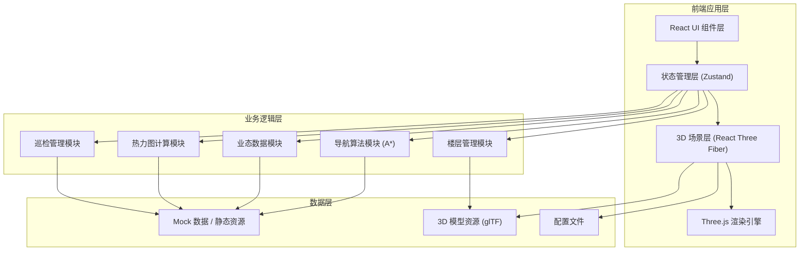
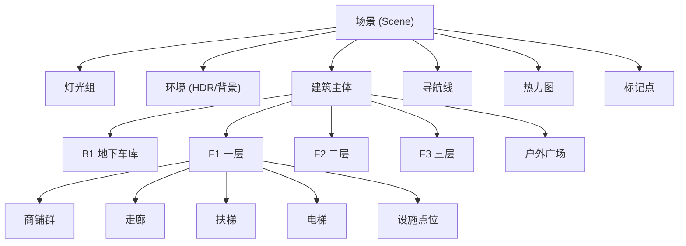

## 1. 架构设计



## 2. 技术描述

- **前端框架**：React 18 + TypeScript
- **构建工具**：Vite 5
- **样式方案**：TailwindCSS 3
- **3D 渲染**：Three.js + @react-three/fiber + @react-three/drei + @react-three/postprocessing
- **状态管理**：Zustand
- **路由管理**：react-router-dom
- **图标库**：lucide-react
- **路径算法**：自定义 A* 寻路算法
- **后端**：纯前端项目，使用 Mock 数据模拟

## 3. 目录结构

```
src/
├── components/          # 通用 UI 组件
│   ├── Sidebar/        # 左侧功能栏
│   ├── TopToolbar/     # 顶部工具栏
│   ├── FloorSwitcher/  # 楼层切换器
│   ├── DetailPanel/    # 详情面板
│   ├── NavPanel/       # 导航面板
│   ├── HeatmapControl/ # 热力图控制
│   ├── PatrolPanel/    # 巡检面板
│   └── StatusBar/      # 底部状态栏
├── pages/
│   └── MainScene/      # 主场景页面
│       ├── index.tsx
│       └── style.css
├── three/              # 3D 场景相关
│   ├── Scene.tsx       # 主场景组件
│   ├── Building.tsx    # 建筑模型
│   ├── Floor.tsx       # 楼层组件
│   ├── Shop.tsx        # 商铺组件
│   ├── NavigationLine.tsx  # 导航线
│   ├── Heatmap.tsx     # 热力图
│   ├── Facilities.tsx  # 设施点位
│   ├── CameraRig.tsx   # 相机控制
│   └── Lights.tsx      # 灯光设置
├── store/              # Zustand 状态
│   ├── useSceneStore.ts
│   ├── useNavStore.ts
│   ├── useShopStore.ts
│   └── usePatrolStore.ts
├── hooks/              # 自定义 Hooks
│   ├── useNavigation.ts
│   ├── useHeatmap.ts
│   └── useLoader.ts
├── utils/              # 工具函数
│   ├── pathfinding.ts  # A* 算法
│   ├── geometry.ts     # 几何计算
│   └── colors.ts       # 颜色工具
├── data/               # Mock 数据
│   ├── shops.ts
│   ├── floors.ts
│   ├── facilities.ts
│   └── navigation.ts
├── types/              # TypeScript 类型
│   ├── index.ts
│   └── three.d.ts
├── App.tsx
├── main.tsx
└── index.css
```

## 4. 路由定义

| 路由 | 页面 | 说明 |
|------|------|------|
| / | 主场景页 | 3D 可视化主界面，包含所有功能模块 |
| /nav | 导航模式 | 专注导航的简化视图 |
| /patrol | 巡检模式 | 巡检专用视图 |

## 5. 核心数据模型

### 5.1 楼层数据

```typescript
interface Floor {
  id: string;
  name: string;
  level: number;      // 楼层编号，B1为-1，F1为1
  height: number;     // 楼层高度
  visible: boolean;
  shops: Shop[];
  facilities: Facility[];
  navGraph: NavNode[]; // 导航节点图
}
```

### 5.2 商铺数据

```typescript
interface Shop {
  id: string;
  name: string;
  brand: string;
  floorId: string;
  category: string;       // 业态分类
  subCategory: string;
  status: 'operating' | 'vacant' | 'renovating';
  leaseEndDate?: string;
  area: number;
  position: { x: number; y: number; z: number };
  dimensions: { width: number; depth: number; height: number };
  color: string;
}
```

### 5.3 设施数据

```typescript
interface Facility {
  id: string;
  type: 'escalator' | 'elevator' | 'toilet' | 'fire' | 'camera' | 'exit' | 'electric';
  name: string;
  floorId: string;
  position: { x: number; y: number; z: number };
  status: 'normal' | 'warning' | 'fault';
  lastInspection?: string;
  linkedFloor?: string;  // 扶梯/电梯连接的楼层
}
```

### 5.4 导航数据

```typescript
interface NavNode {
  id: string;
  floorId: string;
  position: { x: number; y: number; z: number };
  neighbors: string[];  // 相邻节点ID
  type: 'walkway' | 'escalator' | 'elevator' | 'entrance';
}

interface NavRoute {
  nodes: NavNode[];
  totalDistance: number;
  estimatedTime: number;
  floorTransitions: { from: string; to: string; type: string }[];
}
```

### 5.5 热力图数据

```typescript
interface HeatmapData {
  floorId: string;
  points: { x: number; z: number; intensity: number }[];
  timestamp: string;
}
```

## 6. 状态管理

### 6.1 场景状态 (useSceneStore)

```typescript
interface SceneState {
  currentFloor: string;
  visibleFloors: string[];
  visibleLayers: string[];   // 可见图层类别
  cameraMode: 'orbit' | 'firstPerson';
  selectedShop: string | null;
  selectedFacility: string | null;
  isHeatmapVisible: boolean;
  
  setCurrentFloor: (id: string) => void;
  toggleFloor: (id: string) => void;
  toggleLayer: (layer: string) => void;
  selectShop: (id: string | null) => void;
  selectFacility: (id: string | null) => void;
  toggleHeatmap: () => void;
}
```

### 6.2 导航状态 (useNavStore)

```typescript
interface NavState {
  isNavActive: boolean;
  startPoint: NavNode | null;
  endPoint: NavNode | null;
  route: NavRoute | null;
  navProgress: number;  // 0-1 导航进度
  
  setStartPoint: (point: NavNode) => void;
  setEndPoint: (point: NavNode) => void;
  calculateRoute: () => void;
  startNavigation: () => void;
  stopNavigation: () => void;
}
```

### 6.3 商铺状态 (useShopStore)

```typescript
interface ShopState {
  shops: Shop[];
  filterCategory: string | null;
  filterStatus: string | null;
  searchQuery: string;
  
  getShopsByFloor: (floorId: string) => Shop[];
  getShopById: (id: string) => Shop | undefined;
  setFilter: (type: string, value: string | null) => void;
  setSearchQuery: (query: string) => void;
}
```

## 7. 3D 场景架构

### 7.1 场景组成



### 7.2 性能优化策略

1. **按需加载**：按楼层动态加载/卸载3D模型
2. **实例化**：重复元素使用 InstancedMesh
3. **LOD**：不同距离使用不同精度模型
4. **合并几何体**：减少 Draw Call
5. **纹理压缩**：使用 Basis Universal 或 KTX2
6. **视锥剔除**：Three.js 内置优化
7. **状态缓存**：避免重复计算

## 8. 核心算法

### 8.1 A* 寻路算法

- 基于导航网格节点图
- 支持跨楼层（通过扶梯/电梯节点）
- 代价函数：距离 + 楼层换乘代价
- 区分顾客路线和运维巡检路线

### 8.2 热力图生成

- 基于高斯分布的热点扩散
- 使用 WebGL 着色器实时计算
- 支持时间轴动画

## 9. 开发规范

- **组件命名**：PascalCase，使用 .tsx 扩展名
- **文件结构**：每个组件一个文件夹，包含 index.tsx 和 style.css（如需要）
- **类型定义**：优先使用 TypeScript 类型，避免 any
- **状态更新**：使用 Zustand 的 set 方法
- **3D 组件**：放在 src/three/ 目录下，使用 R3F 声明式写法
